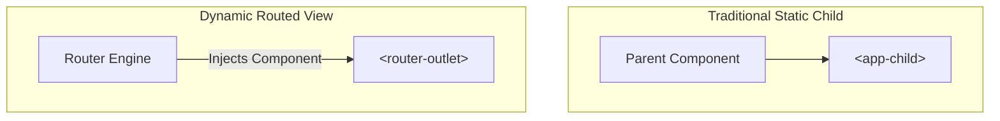

# Angular Routing: Comprehensive Guide

## 1. Introduction to Angular Routing

### What is Routing?
Routing is the mechanism that allows a web application to navigate between different views or components without reloading the entire page. In a traditional multi-page application, every link navigates to a new URL, and the browser fetches a fresh HTML document. In Angular, we use **Client-Side Routing**.

### Single Page Applications (SPA)
Angular is designed for building SPAs. In an SPA:
- Only one HTML page is loaded (usually `index.html`).
- Navigation happens by swapping components in and out of a specific area in the DOM.
- This results in a much faster and smoother "app-like" user experience.

---

## 2. Setting Up Routing

### Route Configuration
Routes are defined as an array of objects. Each object typically has a `path` and a `component` (or `loadComponent` for lazy loading).

```typescript
// app.routes.ts
export const routes: Routes = [
  { path: 'home', component: HomeComponent },
  { path: 'about', component: AboutComponent },
  { path: '', redirectTo: '/home', pathMatch: 'full' }, // Default redirect
  { path: '**', component: NotFoundComponent }       // Wildcard (404)
];
```

### Providing the Router
In modern Angular (Standalone), we providing routing in `app.config.ts`:

```typescript
export const appConfig: ApplicationConfig = {
  providers: [provideRouter(routes)]
};
```

---

## 3. Router Basics

### 3.1 The Router Outlet Secret: Static vs Dynamic

One of the most important concepts to understand is how `<router-outlet>` differs from a traditional child component.

#### comparison: Static Children vs. Routed Views

| Feature | Static Child (`<app-child>`) | Routed View (`<router-outlet>`) |
| :--- | :--- | :--- |
| **Declaration** | Hard-coded in template | Dynamic injection point |
| **Relationship** | Fixed Parent-Child | Decoupled and flexible |
| **Presence** | Always present | Only loaded when route matches |
| **DOM Position** | Nested child | Technically a sibling to surrounding elements |

#### Visual Relationship



> [!IMPORTANT]
> **Key Insight:** The Router Outlet is just a **placeholder**, not a container.
> It doesn't wrap the new page. It just tells Angular: *"Put the new page right here, next to me."*
> Therefore, the new page and the outlet are **siblings**, not parent and child!

#### Practical Example
If you have a navbar and a footer in `app.component.html`, the routed component will sit **between** them.

```html
<!-- app.component.html -->
<app-navbar></app-navbar>

<main>
  <!-- The Router Engine "swaps" components here -->
  <router-outlet></router-outlet> 
</main>

<app-footer></app-footer>
```

### RouterLink (Declarative Navigation)
Used in templates to navigate between routes. It's better than `href` because it prevents page reloads.

```html
<a routerLink="/home" routerLinkActive="active">Home</a>
<a [routerLink]="['/products', 101]">Product 101</a>
```

### Router Service (Imperative Navigation)
Used in TypeScript to navigate programmatically.

```typescript
import { Router } from '@angular/router';

constructor(private router: Router) {}

navigateToHome() {
  this.router.navigate(['/home']);
}
```

---

## 4. Passing Data Between Routes

### Route Parameters
For fixed ID-based navigation (e.g., `/products/101`).

- **Configuration**: `{ path: 'products/:id', component: ProductComponent }`
- **Sending**: `this.router.navigate(['/products', 101])`
- **Receiving**: `this.route.snapshot.paramMap.get('id')` OR `this.route.params.subscribe(...)`

### Query Parameters
For optional metadata (e.g., `/products?filter=blue`).

- **Sending**: `this.router.navigate(['/products'], { queryParams: { filter: 'blue' } })`
- **Receiving**: `this.route.queryParams.subscribe(...)`

### `snapshot` vs `subscribe`
When retrieving route parameters or query parameters, you have two options:
- **`snapshot` (The Shortcut)**: Read the value *once* when the component is created. Best for simple cases where the route data never changes while the component is alive. 
  Example: `this.route.snapshot.paramMap.get('id')`
- **`subscribe` (The Observable)**: Listen for changes continuously. Angular *reuses* component instances if you navigate to the same component but with different parameters (e.g., from `/user/1` to `/user/2`), to save resources. When this happens, `ngOnInit` does *not* run again. A `snapshot` would keep the old ID (`1`), but a `subscribe` will emit the new ID (`2`), allowing you to update the view without a full page reload.

> [!CAUTION]
> Always use `subscribe` if your component has links that route to itself with different parameters!

### Navigation State
For passing complex objects without showing them in the URL.

- **Sending**: `this.router.navigate(['/details'], { state: { user: someUserObj } })`
- **Receiving**: `this.router.getCurrentNavigation()?.extras.state` (Constructor only!)

---

## 5. Advanced Routing Concepts

### Child Routes (Nested Routing)
Allows you to have sub-views within a parent component.

```typescript
{
  path: 'dashboard',
  component: DashboardComponent,
  children: [
    { path: 'stats', component: StatsComponent },
    { path: 'profile', component: ProfileComponent }
  ]
}
```

### Lazy Loading
Loads feature modules or components only when the user navigates to them, reducing initial bundle size.

```typescript
{
  path: 'admin',
  loadComponent: () => import('./admin/admin.component').then(m => m.AdminComponent)
}
```

### Route Guards
Intercept navigation to check for permissions (e.g., Authentication).

- `CanActivate`: Can the user enter this route?
- `CanDeactivate`: Can the user leave this route?

---

## 6. Special Topics

### Comparisons: `navigate` vs `navigateByUrl`

| Feature | `router.navigate()` | `router.navigateByUrl()` |
| :--- | :--- | :--- |
| **Input** | Array of segments: `['/users', 10]` | Absolute string: `'/users/10'` |
| **Context** | Support relative navigation | Always absolute (from root) |
| **Complexity** | Good for dynamic segments | Simpler for static URLs |

### Relative Routing
Using `relativeTo` to navigate based on the current active route.

```typescript
this.router.navigate(['details'], { relativeTo: this.route });
```

---

## 7. Router Utilities & Configuration

### 7.1 RouterModule (The Foundation)

`RouterModule` is the core module that provides the necessary directives and providers for routing to work in an Angular application.

#### How to Declare
In a traditional **Module-based** application, you import it in your `AppModule`:

```typescript
@NgModule({
  imports: [
    RouterModule.forRoot(routes) // Use forRoot for the main routes
  ],
  exports: [RouterModule]
})
export class AppRoutingModule { }
```

In a **Standalone-based** application (modern Angular), we use `provideRouter`:

```typescript
// app.config.ts
export const appConfig: ApplicationConfig = {
  providers: [
    provideRouter(routes)
  ]
};
```

### 7.2 RouterOutlet (The Placeholder)

The `<router-outlet>` is a directive that acts as a placeholder that Angular dynamically fills based on the current router state.

#### How it Works
1. When you navigate to a URL, the **Router Engine** searches the configuration for a matching path.
2. Once found, it identifies the associated **Component**.
3. It then "injects" that component into the nearest `<router-outlet>`.

#### Usage
Simply place it in your template where you want the routed components to appear.

```html
<nav>...</nav>
<main>
  <router-outlet></router-outlet> <!-- Dynamic Content Here -->
</main>
<footer>...</footer>
```

> [!TIP]
> You can have multiple outlets by using **Named Outlets** (e.g., `<router-outlet name="sidebar"></router-outlet>`), allowing for complex dashboard layouts.

---

## 8. Modern Standalone Routing Features

Angular 16+ introduced powerful new features for the router, especially when using Standalone Components.

### `withComponentInputBinding()`
Automatically maps route parameters, query parameters, and route data directly to component `@Input()` properties. This eliminates the need to manually inject and subscribe to `ActivatedRoute`.

**Configuration:**
```typescript
export const appConfig: ApplicationConfig = {
  providers: [provideRouter(routes, withComponentInputBinding())]
};
```

**Simple Idea:**
URL → directly goes into `@Input()`

**📌 Example:**
```typescript
@Input() id!: string;
@Input() filter?: string;
```
URL: `/user/10?filter=active`
👉 Angular will automatically do: `id = 10`, `filter = 'active'` (No need for `ActivatedRoute`!)

**Usage in Component:**
Instead of `this.route.params.subscribe(...)`, just use `@Input()`!
```typescript
@Component({...})
export class ProductComponent {
  // Matches /products/:id
  @Input() id!: string; 
  // Matches /products?filter=blue
  @Input() filter?: string; 
}
```

### `withViewTransitions()`
Enables smooth, native page transitions using the browser's **View Transitions API** when navigating between routes, without relying on complex Angular Animations.

```typescript
export const appConfig: ApplicationConfig = {
  providers: [provideRouter(routes, withViewTransitions())]
};
```

**Simple Idea:**
Page change → smooth animation effect (not sudden).

**📌 Example:**
- **Without:** page instantly changes.
- **With:** fade / smooth transition.
- **Result:** Better UI experience.

*Note: You can customize these transitions in your CSS using `::view-transition-old()` and `::view-transition-new()` pseudo-elements.*

### `withInMemoryScrolling()`
Automatically manages scroll position restoration when navigating backward or forward, or anchoring to specific elements.

```typescript
export const appConfig: ApplicationConfig = {
  providers: [
    provideRouter(routes, withInMemoryScrolling({
      scrollPositionRestoration: 'enabled',
      anchorScrolling: 'enabled'
    }))
  ]
};
```

**Simple Idea:**
Remembers where you scrolled.

**📌 Example:**
- `scrollPositionRestoration: 'enabled'`: Go back → scroll goes to old position.
- `anchorScrolling: 'enabled'`: `/page#section` → scrolls to that section.
```

---

## 9. Advanced Route Guards (Functional Guards)

Modern Angular favors **Functional Guards** over the older Class-based guards. They are simpler, more concise, and easily composable.

### `CanActivateFn` (Access Control)
Determines if a route can be activated (entered). Best for Authentication checks.

```typescript
export const authGuard: CanActivateFn = (route, state) => {
  const authService = inject(AuthService);
  const router = inject(Router);

  if (authService.isLoggedIn()) {
    return true;
  }
  return router.parseUrl('/login'); // Redirect to login
};

// In app.routes.ts
{ path: 'dashboard', component: DashboardComponent, canActivate: [authGuard] }
```

### `CanMatchFn` vs `CanActivateFn`
`CanMatchFn` checks if a route should even be *considered* during URL matching.
If `CanMatch` returns `false`, the router acts as if the route doesn't exist and continues searching for other matches (like a 404 wildcard). 

> [!IMPORTANT]
> **Always use `CanMatch` for Lazy-Loaded Routes!**
> If you use `CanActivate` on a lazy-loaded route, Angular will download the module's code *before* checking the guard. `CanMatch` checks the guard *before* downloading the code, saving bandwidth and improving security.

### `CanDeactivateFn` (Unsaved Changes)
Warns a user before they leave a route with unsaved form data.

```typescript
export const pendingChangesGuard: CanDeactivateFn<SignupComponent> = (component) => {
  if (component.hasUnsavedChanges) {
    return confirm('You have unsaved changes. Do you really want to leave?');
  }
  return true;
};
```

---

## 10. Route Resolvers (`ResolveFn`)

Resolvers allow you to pre-fetch data *before* a route renders. This prevents 'UI jumps' or showing empty pages while data loads in `ngOnInit`. The route navigation will pause until the Resolver's Observable completes.

### Defining a Resolver
```typescript
export const userResolver: ResolveFn<User> = (route, state) => {
  const userId = route.paramMap.get('id')!;
  return inject(UserService).getUserById(userId);
};
```

### Configuring the Resolver
```typescript
{ 
  path: 'user/:id', 
  component: UserProfileComponent, 
  resolve: { userData: userResolver } 
}
```

### Consuming the Resolved Data
Since data is pre-fetched, we can read it synchronously or via the `@Input()` binding (if `withComponentInputBinding` is enabled).

```typescript
@Component({...})
export class UserProfileComponent {
  // Auto-injected via withComponentInputBinding() matching the 'userData' key!
  @Input() userData!: User; 
}
```

---

## 11. Deep Dive: Lazy Loading

Lazy loading is essential for performance. It splits your application bundle into smaller chunks that are loaded on demand.

### Lazy Loading a Single Standalone Component
Best for individual pages (like a Settings page).
```typescript
{ 
  path: 'settings', 
  loadComponent: () => import('./settings/settings.component').then(m => m.SettingsComponent) 
}
```

### Lazy Loading Multiple Routes (`loadChildren`)
Best for entire feature areas with their own sub-routes (e.g., an Admin Dashboard).

**admin.routes.ts**
```typescript
export const adminRoutes: Routes = [
  { path: '', component: AdminDashboardComponent },
  { path: 'users', component: AdminUsersComponent },
  { path: 'reports', component: AdminReportsComponent }
];
```

**app.routes.ts**
```typescript
{ 
  path: 'admin', 
  loadChildren: () => import('./admin/admin.routes').then(m => m.adminRoutes) 
}
```
